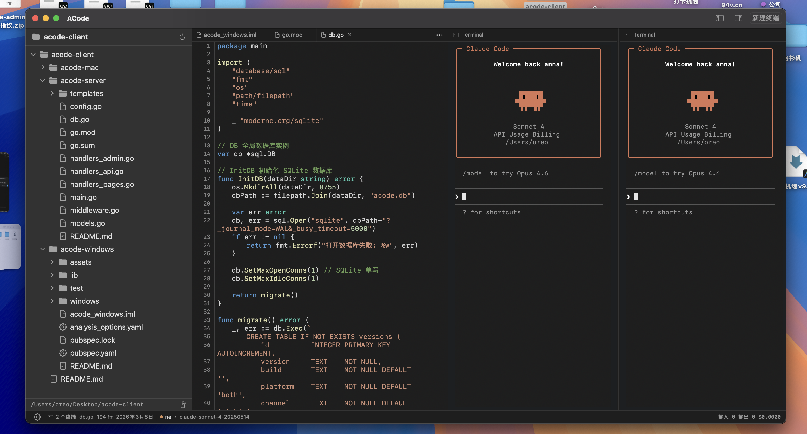
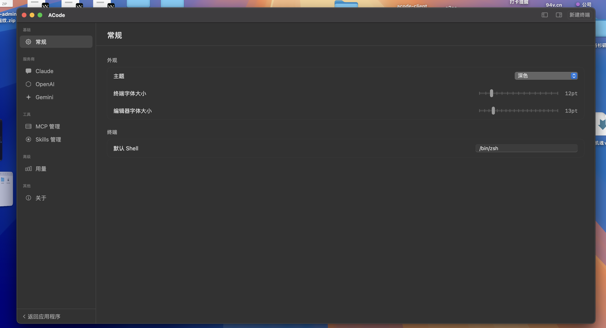

# ACode

<p align="center">
  <strong>跨平台 AI 编程终端 — 多终端分屏 + AI CLI Provider 管理</strong>
</p>

<p align="center">
  
  
  
  
</p>

---

## ✨ 软件截图

| 主界面：文件浏览器 + 代码编辑器 + 双终端分屏 | 设置面板：Provider / MCP / Skills 管理 |
|:---:|:---:|
|  |  |

---

## 📖 简介

**ACode** 是一款专为 AI 编程设计的跨平台终端客户端，集成了多终端管理、AI CLI Provider 统一管理、MCP 服务器配置、自定义技能指令等功能。支持 **Claude Code**、**OpenAI Codex**、**Gemini CLI** 等主流 AI 编程工具的一站式配置与环境管理。

> 一个终端，管理所有 AI 编程工具。

---

## 🚀 核心功能

| 功能 | 说明 |
|------|------|
| 🖥️ **多终端标签页** | 支持多个终端同时运行，水平/垂直分屏 |
| 🤖 **AI Provider 管理** | Claude Code / OpenAI Codex / Gemini CLI 的添加、切换、删除 |
| ⚙️ **配置文件自动写入** | 切换 Provider 后自动更新各 CLI 配置文件 |
| 🔑 **环境变量注入** | 每个终端独立持有 Provider 环境变量 |
| 📦 **预设供应商** | 一键添加常用供应商（官方 / DeepSeek / OpenRouter 等） |
| 🔌 **MCP 服务器管理** | 手动/预设添加 MCP 服务器，同步写入 CLI 配置 |
| 🎯 **自定义技能** | 创建自定义 AI 指令，同步到各 CLI 工具的指令文件 |
| 📁 **文件浏览器** | 树形目录、文件图标、上下文操作 |
| ✏️ **代码编辑器** | 文本编辑、语法高亮、图片预览 |
| 📊 **Token 用量统计** | 实时统计输入/输出 Token 和预估费用 |
| 🔄 **自动更新** | 支持 OTA 自动检查、下载、安装更新 |

---

## 🏗️ 项目结构

```
acode-client/
├── acode-mac/              # macOS 原生版本 (Swift + SwiftUI)
│   └── ACode/
│       └── Sources/
│           ├── App/        # 应用入口 + 全局状态
│           ├── Models/     # 数据模型
│           ├── Database/   # SQLite 数据库层
│           ├── Services/   # 业务逻辑服务
│           ├── Views/      # UI 视图 (Main / Settings / Terminal / FileExplorer)
│           └── Utils/      # 工具类
│
├── acode-windows/          # Windows 版本 (Flutter + Dart)
│   └── lib/
│       ├── app/            # 全局状态 (Provider)
│       ├── models/         # 数据模型
│       ├── database/       # SQLite 数据库层
│       ├── services/       # 业务逻辑服务
│       ├── views/          # UI 视图 (Main / Settings / Terminal / FileExplorer)
│       └── utils/          # 工具类
│
└── acode-server/           # 更新服务后端 (Go)
    ├── main.go             # 入口，路由注册
    ├── config.go           # 配置管理
    ├── db.go               # SQLite 数据库层
    ├── handlers_*.go       # API / 管理后台 / 公共页面
    └── templates/          # HTML 模板
```

---

## 💻 各平台技术栈

### macOS

| 组件 | 技术 |
|------|------|
| 框架 | SwiftUI + AppKit (macOS 14+) |
| 终端 | SwiftTerm (LocalProcessTerminalView) |
| 数据库 | SQLite.swift |
| 自动更新 | Sparkle |

### Windows

| 组件 | 技术 |
|------|------|
| 框架 | Flutter 3.38+ (Windows Desktop) |
| 语言 | Dart 3.10+ |
| UI | Fluent UI + Material 3 |
| 终端 | xterm + flutter_pty (ConPTY) |
| 数据库 | SQLite (sqflite_common_ffi) |
| 窗口管理 | window_manager |

### 更新服务 (acode-server)

| 组件 | 技术 |
|------|------|
| 语言 | Go |
| 数据库 | SQLite (modernc.org/sqlite，无 CGo) |
| Web | net/http + html/template |
| 安全性 | bcrypt + HMAC-SHA256 Session |

---

## 🛠️ 快速开始

### macOS

```bash
cd acode-mac/ACode
# 直接用 Xcode 打开
open Package.swift

# 或者命令行构建
swift build
swift run ACode
```

### Windows

```powershell
cd acode-windows
flutter pub get
flutter run -d windows
```

### 更新服务

```bash
cd acode-server
go build -o acode-server .
./acode-server
```

> 首次运行自动生成 `config.json`，默认管理员: `admin` / `acode2025`，请立即修改默认密码。

---

## ⌨️ 快捷键

| 快捷键 | 功能 |
|--------|------|
| `Ctrl/⌘ + T` | 新建终端 |
| `Ctrl/⌘ + O` | 打开文件夹 |
| `Ctrl/⌘ + D` | 垂直分屏 |
| `Ctrl/⌘ + Shift + D` | 水平分屏 |
| `Ctrl/⌘ + S` | 保存文件 |
| `Ctrl/⌘ + ,` | 打开/关闭设置 |
| `Esc` | 关闭设置 |

---

## 🔌 支持的 AI CLI 工具

- **[Claude Code](https://docs.anthropic.com/en/docs/claude-code)** — Anthropic 官方 CLI
- **[OpenAI Codex](https://platform.openai.com/)** — OpenAI CLI
- **[Gemini CLI](https://ai.google.dev/)** — Google Gemini CLI

---

## 📡 更新服务 API

| 接口 | 说明 |
|------|------|
| `GET /api/v1/update/check?version=x.x.x&platform=windows` | 检查更新 |
| `GET /api/v1/latest?platform=windows` | 获取最新版本 |
| `GET /versions` | 公共版本历史页 |

---

## 💬 交流反馈

如果你对 ACode 有任何问题、建议或想法，欢迎加入我们的交流群：

| 平台 | 群号 |
|------|------|
| QQ 群 | **1076321843** |

---

## 📄 License

MIT License © [CrispVibe](https://github.com/crispvibe)
